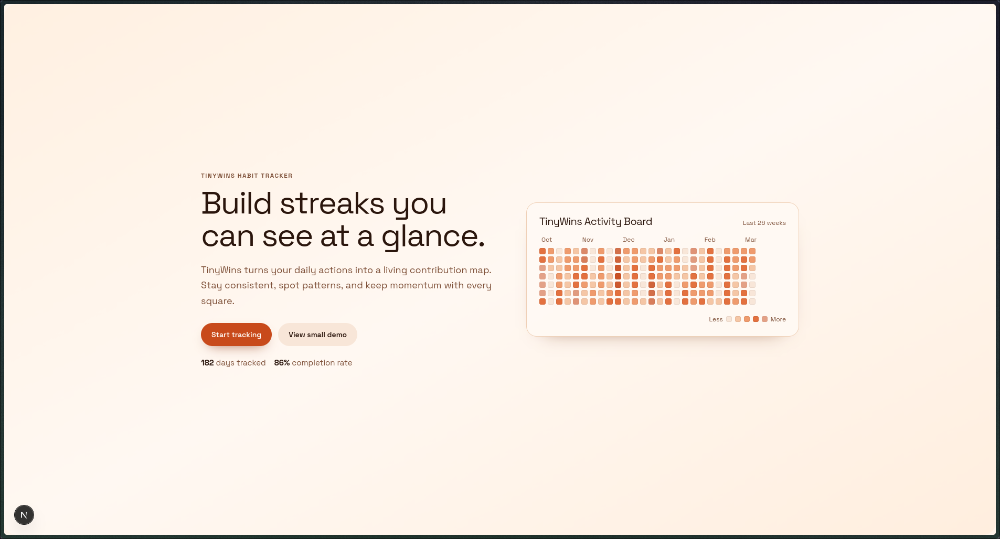

# Frontend

Next.js app for the habit tracker dashboard.



## Stack

- Next.js App Router
- React 19
- Tailwind CSS 4
- Bun (recommended)

## Prerequisites

- Bun installed
- Backend API running locally (default: `http://localhost:8800`)

## Environment

Copy the example env and update values if needed:

```bash
cp .env.example .env.local
```

Required variables:

- `NEXT_PUBLIC_BACKEND_URL` (example: `http://localhost:8800`)
- `NEXT_PUBLIC_COOKIE_NAME` (must match backend `COOKIE_NAME`)

## Run

```bash
bun install
bun dev
```

Open `http://localhost:3000`.

## Build

```bash
bun run build
bun run start
```

## Current Dashboard Notes

- `/dashboard` requires a valid session cookie from the backend.
- Habit list data is fetched from `GET /habits`.
- Creating habits uses `POST /habits`.
